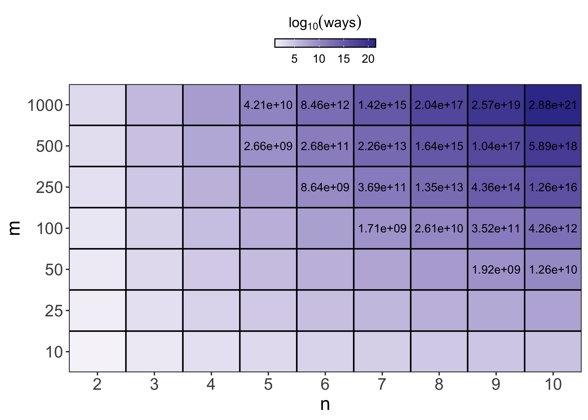
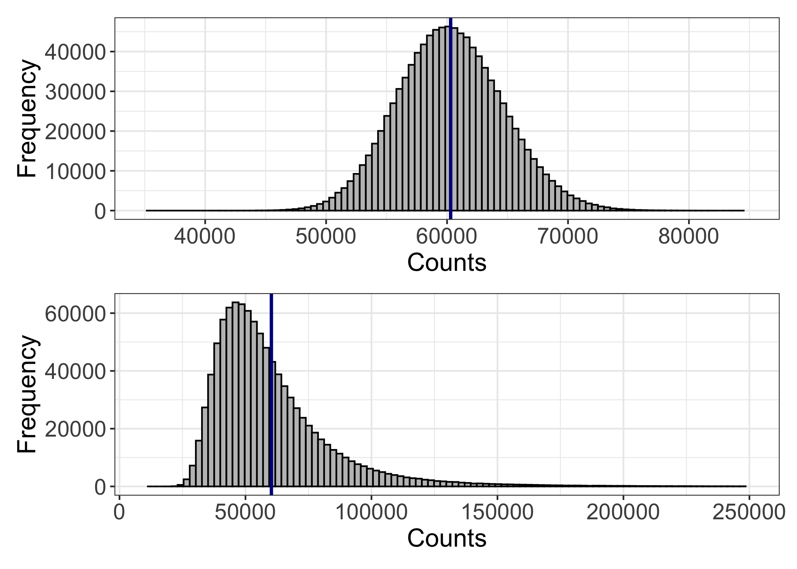
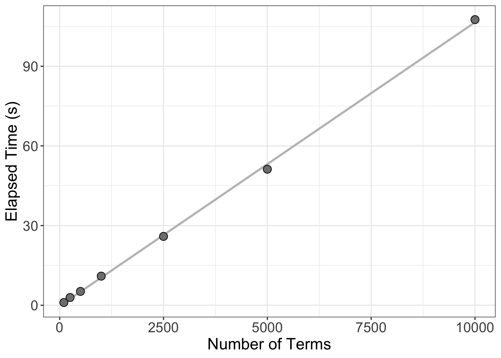
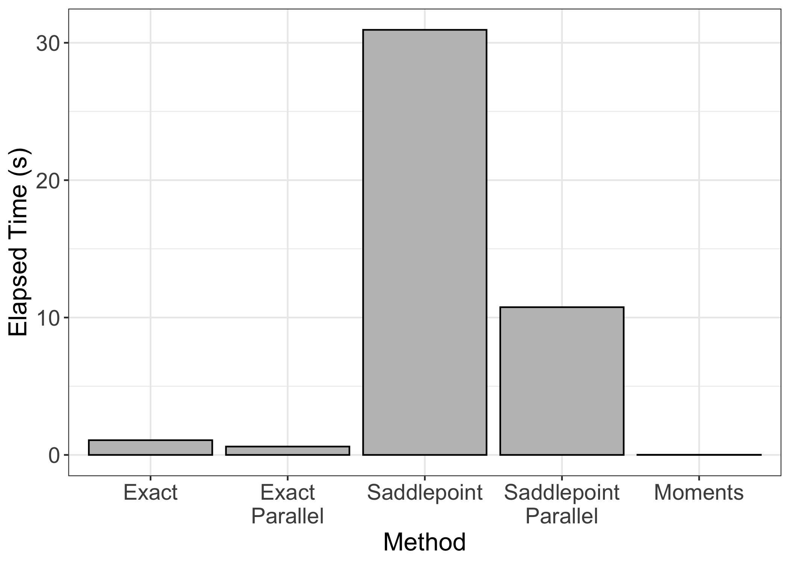
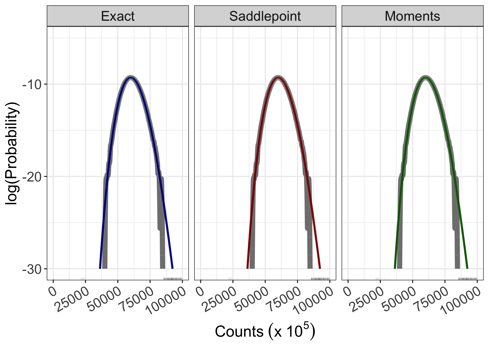
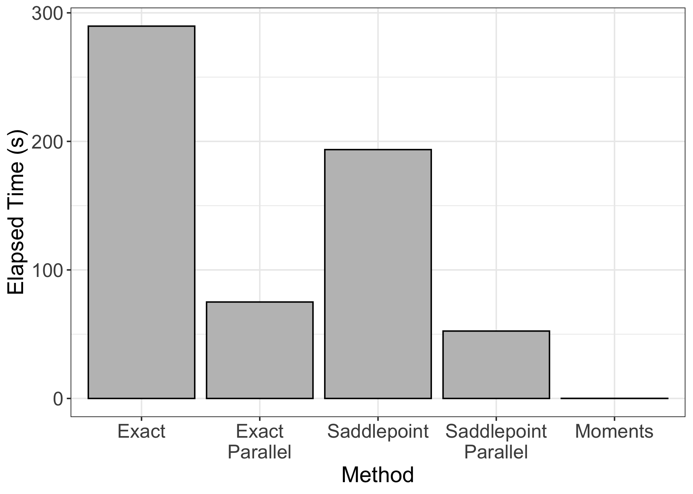
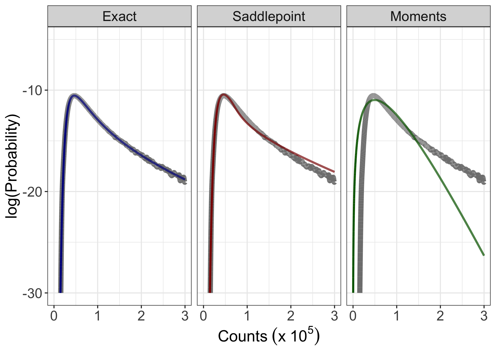

### Introduction to the NB distribution

The negative binomial (NB) distribution is widely used to model count
data whose variance is greater than expected given a standard binomial
or Poisson distributions. While the NB distribution has been used across
scientific disciplines, the usage that is most relevant to my interests
is its use in describing genomic data. While the need doesn’t often
arise in genomic applications to calculate the sum of NB distributions,
there are some personal areas of interest where doing so may be useful.
As such, I sought to better understand the sum of NB random variables
with arbitrary parameters. I thought that I would share my findings, as
it was easier to find examples of people with similar questions rather
than concrete answers to those questions (though eventually I found
both).

Before I get into the sums of independent NB distributions, however, I
should define the parameters of a NB distribution. There are many
equivalent parameterizations of NB distributions. Perhaps the most
common are: \$ Y \sim NB(\phi, p) \$, \$ Y \sim NB(\phi, \mu) \$, and \$
Y \sim NB(\alpha, \mu) \$. In these formulations, $p$ is the probability
of success of a single trial, $\mu$ is the distribution mean, and $\phi$
and $\alpha$ are different representations of the dispersion parameter.
As the name suggests, the dispersion parameter describes the spread of
the distribution and is related to the distribution variance through the
equation

$$ Var(Y) = \mu + \frac{\mu^2}{\phi} $$

$\phi$ can be replaced with $\alpha$ through the relationship

$$ \alpha = \frac{1}{\phi} $$

In addition, $p$ and $\mu$ are related by the equation

$$ p = \frac{\phi}{\phi + \mu} $$

Conveniently, all three of the parameterizations listed above can be
readily interconverted. To be consistent with the typical R
parameterization of the NB distribution, all of the functions that I
describe below take as input either $\mu$ or $p$ and expect $\phi$ as
the dispersion parameter.

### Exact solutions

Convolutions of NB random variables take a closed form only when the
probabilities of success are the same across the random variables being
summed. That is, for random variables $Y_i \\sim NB(\\phi_i,p)$,
$\\sum Y_i \\sim NB(\\sum \\phi_i, p)$. It is easy to imagine
situations, however, when both $\\phi$ <i>and</i> $p$ vary. What, then,
is the distribution of the sum of these random variables?

[Furman](https://ssrn.com/abstract=1650365) was the first to derive an
exact expression for the PMF of the sum of NB random variables with
arbitrary parameters. As an interesting note, he additionally showed
that the distribution of the sum is negative binomially distributed,
<i>but with an additional random term</i>. The PMF derived by Furman is

$$ P(X=x) = R \sum \limits_{k=0}^\infty \delta_k \frac{\Gamma(\phi + x + k)}{\Gamma(\phi + k)x!} p_1^{\phi + k} (1-p_1)^x $$

where,

$$ R = \prod \limits_{j=1}^n \Bigl ( \frac{q_jp_1}{q_1p_j}\Bigr )^{-\phi_j}$$,

$$ \delta_{k+1}  = \frac{1}{k+1} \sum \limits_{i=1}^{k+1} i\xi_i\delta_{k+1-i} $$,
where $k = 0,1,2,...$ and $\\delta_0=1$,

$$ \xi_i = \sum \limits_{j=1}^n \frac{ \phi_j(1-q_1p_j/q_jp_1)^i }{i} $$,

$$ q_j = 1-p_j $$,

$$ p_1 = \max(p_j) $$,

$$ q_1 = 1-p_1 $$, and

$$ \phi = \sum \limits_{j=1}^n \phi_j $$.

Furman’s PMF is a series representation that depends on $\\delta_k$, a
recursive parameter that is computed for each term included in the
series. What’s more, for every count value at which the PMF is
evaluated, the sum is taken over every $k$. This can make for a pretty
cumbersome calculation when the number of terms and/or the vector length
of counts is large. In addition, because the number of terms over which
the sum is evaluated cannot be infinite, evaluation of Furman’s PMF is
<i>technically </i> an approximation (but a very, very good one). A more
compact exact expression was [published by
Vellaisamy](https://www.jstor.org/stable/25662420) a couple of years
after Furman’s. However, this representation requires enumerating all
possible ways that $n$ non-negative integers can sum to $m$, where $m$
is the maximum value of counts for which the PMF is being evaluated.
This quickly becomes unwieldy for all but the smallest $n$ and $m$.
Below, I’ll demonstrate why.

The number of ways $n$ non-negative integers can sum to to $m$ is

$$ \frac{(m + n - 1)!}{(n-1)!m!} $$

We can write a simple function to evaluate this equation for a handful
of $m$ and $n$ values. I’ll use the log scale for this because as $m$
increases, computing $m!$ is going to run into overflow problems.

``` r
nni_combos <- function(n, m){
  exp(lfactorial(m+n-1) - (lfactorial(n-1) + lfactorial(m)))
}
```

Defining vectors of $m$ counts and $n$ non-negative integers to plug
into the function, we can calculate the number of possible combinations
at each $m$ for each $n$.

``` r
m.vec <- c(10, 25, 50, 100, 250, 500, 1000)
n.vec <- 2:10

ways <- data.frame(
  sapply(X = n.vec,
         FUN = function(x) {
           nni_combos(m = m.vec, n = x)
           }))

colnames(ways) <- paste0("n=", n.vec)
rownames(ways) <- paste0("m=", m.vec)
```

The heat map below shows how quickly the number of possible combinations
increases. For the sum of even a handful of distributions, the number of
possible combinations exceeds $1 \times 10^9$ as $m$ reaches
$10^2 - 10^3$ (qualifying values are enumerated in the plot on the
linear scale). Matrices and other arrays in R have an index limit of
$2^{31}-1$ per dimension, or \~$2.15 \times 10^9$. Longer vectors are
possible — up to $2^{52}$ elements (\~$4.50 \times 10^{15}$) — but even
this limit would be reached fairly quickly (assuming no memory issues
popped up beforehand…). Therefore, implementing Vellaisamy’s PMF for the
sum of even a moderate number of NB distributions is impractical, if not
effectively impossible.



### Alternative approaches

Should evaluation of Furman’s PMF become impractical due to the
aforementioned computational bottlenecks, what alternatives exist to
evaluate NB convolutions? Martin Modrák has written a wonderful [blog
post](https://www.martinmodrak.cz/2019/06/20/approximate-densities-for-sums-of-variables-negative-binomials-and-saddlepoint/)
describing two approximate methods for evaluating the sums in question:
saddlepoint approximation and a simpler method of moments approach.

#### Method of moments

The method of moments approach is fairly intuitive and easy to
implement. Briefly, because both the mean and variance of independent
random variables are linear operators, for random variables
$Y_i \\sim NB(\\phi_i, \\mu_i)$,

$$ \mathbb{E} \Bigl( \sum Y_i \Bigr) = \sum \mu_i $$

$$ Var \Bigl( \sum Y_i \Bigr) = \sum \Bigl( \mu_i + \frac{\mu^2}{\phi} \Bigr) $$

It follows from this observation that the sum of NB random variables
might be well approximated by the combined mean $\\bar \\mu$ and
dispersion parameter $\\bar \\phi$ plugged into a standard NB
distribution.

In other words,

$$ \sum Y_i \sim NB(\bar \phi, \bar \mu) $$

where,

$$ \bar  \mu = \sum \mu_i $$

and

$$ \bar  \phi = \frac{\bigl( \sum \mu_i\bigr)^2 }{ \sum \frac{\mu_i^2}{\phi_i} } $$

<br>

#### Saddlepoint approximation

The saddlepoint approximation is slightly more complicated. I don’t want
to go into too much detail here, but I want to give enough information
so that the general idea can be easily followed. Martin provides more
mathematical detail in his post. If you’re curious, I encourage you to
visit his page for more information.

The saddlepoint approximation requires knowing the cumulant generating
function $K(t)$ of a target distribution, as well as $K(t)$’s first and
second derivatives, $K^\prime(t)$ and $K^{\prime\prime}(t)$,
respectively. By definition, $K(t)$ is just the log of the moment
generating function, or \$ K(t) = log \\,\mathbb{E}\[e^{tX}\] \$. MGFs
for most well-known distributions are easily found online, so obtaining
$K(t)$ isn’t too difficult. The trickier part is in ensuring the target
CGF is twice differentiable. Fortunately, the CGF of the NB distribution
is!

With $K(t)$, $K^\prime(t)$, and $K^{\prime}{\prime}(t)$ in hand, the
saddlepoint approximation then requires finding the saddlepoint $s_x$ at
a given $x$ by solving the equation

$$ K^\prime(s_x) = x $$

Then, with $s_x$ known, the probability density at $x$ is approximated
by

$$ f(x) \simeq \frac{1}{\sqrt {2 \pi K^{\prime\prime} (s_x)}} \exp({K(s_x)-xs_x}) $$

Martin conveniently derived $K(t)$, $K^\prime(t)$, and
$K^{\prime\prime}(t)$ for NB distributions in his blog post. I will
repost those equations here, but all credit for their derivation goes to
him. The three equations I am interested in are:

$$ K(t)  = \sum \limits_{i=1}^n \phi_i[log(\phi_i) - log(\phi_i + \mu_i(1−e^t))]  $$

$$ K^\prime(t) = \sum \limits_{i=1}^n \frac{\phi_i\mu_ie^t}{\phi_i + \mu_i(1-e^t)} $$

$$ K^{\prime\prime}(t) = \sum \limits_{i=1}^n \frac{\phi_i\mu_i(\phi_i + \mu_i)e^t}{(\phi_i + \mu_i(1-e^t))^2} $$

As noted by Martin, and as you can deduce from the equation for $K'(t)$
above, $s_x$ is not defined for $x=0$. Therefore, $f(0)$ is evaluated as

$$ f(0) = \prod_i P(X_i=0) = \prod_i NB(0 | \mu_i,\phi_i) $$

To give credit where its due, for the implementation of the NB
saddlepoint approximation, I relied heavily on [this
post](https://stats.stackexchange.com/questions/72479/generic-sum-of-gamma-random-variables/137318#137318)
to get my bearings.

### Package information

I’ve wrapped up the functions to evaluate the sum of aribtrary NB
distributions in the <code>nbconv</code> package, which can be
downloaded from [GitHub](%22https://github.com/gbedwell/nbconv%22). All
of the implementations included in this package are written in R, so
they’re not expected to be as fast as implementations in C/C++ or a
language like Stan that is translated to C/C++. Nevertheless, as it is
currently written, <code>nbconv</code> provides an easy, R-compatible
resource for computing the sums in question. I hope to improve
performance by including C/C++ (or C/C++ interpreted) implementations in
the future.

To quickly install the package, use

``` r
devtools::install_github(repo = "gbedwell/nbconv")
```

and then load the package

``` r
library(nbconv)
```

### Sample data

To begin comparing methods, I’ll make some sample data.

I’ll make two sample distributions — one somewhat symmetrical
distribution and one with a heavier tail. The reason for the two
distributions is that Martin showed that the saddlepoint approximation
performed better than the method of moments approximation for the
heavier tailed distribution, while the performance was more or less the
same for the more symmetrical distribution.

Each combined distribution will be composed of 50 individual NB
distributions. The simulated $\\mu$ values will be randomly sampled from
a uniform distribution between 1 and 2500. For the symmetrical
distribution, all 50 $\\phi$ values will be sampled from a uniform
distribution between 0 and 8. For the heavier tailed distribution, 25 of
the $\\phi$ values will be sampled from a unifrom distribution between 0
and 10, while the other 25 $\\phi$ values will be sampled from a uniform
distribution between 0 and 1. This extra dispersion will generate the
desired tail.

In some respects, these are fairly extreme test data sets. While the
number of distributions isn’t huge, it isn’t small, either. In addition,
the means of the individual distributions are fairly large. I made the
test data this way in an attempt to make the magnitude of the target
distribution at least somewhat representative of the magnitude of the
genomic data that I am most interested in. This will let me know how
each of the three evaluation methods performs in the context that I am
most likely to use them in. Inclusion of the heavier tailed distribution
will additionally test the 3 evaluation methods in a rather extreme
(though not necessarily commonly encountered) scenario.

``` r
set.seed(1000)
mus <- runif(50, min = 1, max = 2500)

set.seed(1000)
phis1 <- runif(50, min = 0, max = 8)

set.seed(1000)
phis2 <- sample(phis1, 25, replace = FALSE)

set.seed(1000)
phis2 <- c(phis2, runif(25, min=0, max=0.5))
```

With the distribution parameters defined, I’ll create empirical
distributions using <code>nbconv::nb_empirical_sum()</code>

``` r
empirical.sum1 <- nb_empirical_sum(mus = mus, phis = phis1, n = 1e6)
empirical.sum2 <- nb_empirical_sum(mus = mus, phis = phis2, n = 1e6)
```

and plot the respective histograms to get a better idea of the shapes of
each distribution.

``` r
library(patchwork)

empirical.dist1 <- ggplot(data = data.frame(x = empirical.sum1), aes(x = x)) +
  geom_histogram(bins = 100, color = "black", fill = "gray75") +
  geom_vline(xintercept = mean(empirical.sum1), color = "darkblue", size = 1) +
  theme_bw() +
  theme(axis.title = element_text(size = 16),
        axis.text = element_text(size = 14)) +
  scale_x_continuous(limits = c(35e3, 85e3),
                     breaks = c(40e3, 50e3, 60e3, 70e3, 80e3)) +
  labs(x = "Counts", y = "Frequency")

empirical.dist2 <- ggplot(data = data.frame(x = empirical.sum2), aes(x = x)) +
  geom_histogram(bins = 100, color = "black", fill = "gray75") +
  geom_vline(xintercept = mean(empirical.sum2), color = "darkblue", size = 1) +
  theme_bw() +
  theme(axis.title = element_text(size = 16),
        axis.text = element_text(size = 14)) +
  scale_x_continuous(limits = c(10e3, 250e3)) +
  labs(x = "Counts", y = "Frequency")

empirical.dist1 + empirical.dist2 + plot_layout(ncol = 1)
```


<br>

As expected, the first distribution is approximately symmetrical about
the mean while the second is highly tailed. Interestingly, despite their
wildly different shapes, the distributions have similar means (60296.93
and 60281.21, respectively, denoted by the blue vertical lines). Is this
difference real, or is it simple sampling error? I suppose we’re likely
to find out soon!

For the purposes of downstream analysis, I want to define the maximum
number of counts at which I want to evaluated the respective
distributions. Based on the histogram of the first distribution,
evaluating out to 100,000 counts seems sufficient for the probabilities
to approach zero. For the second distribution, the slow rightward creep
makes it a little more difficult to land on an end point. For
computational brevity, I’ll say 300,000 is sufficient, though in reality
I should probably go out a little farther.

``` r
n.counts1 <- 1e5
n.counts2 <- 3e5
```

### Evaluation of methods

#### Impact of the number of terms

Before comparing the three methods, I want to assess the impact of the
number of terms on the evaluation of the exact function with respect to
numeric accuracy. I want to be accurate, but I also don’t want to
include so many terms that it unnecessarily prolongs evaluation. To
assess accuracy, I will evaluate the probability densities for the first
distribution using the exact method with 10000, 5000, 2500, 1000, 500,
250, and 100 terms included, respectively.

``` r
terms.time <- data.frame(
  terms = c(10000, 5000, 2500, 1000, 500, 250, 100),
  time = c(
    sapply(X = c(10000, 5000, 2500, 1000, 500, 250, 100),
           FUN = function(x){
             system.time(
               assign(x = paste0("sum.exact.", x), 
                      value = nb_sum_exact(mus = mus,
                                           phis = phis1,
                                           n.terms = x,
                                           counts.start = 0,
                                           counts.end = n.counts1),
                      inherits = TRUE))[3]
             }
           )
    )
  )
```

I can additionally assess runtime. Runtime should increase as $O(N)$
with the number of terms. The plot below verifies that expectation.

``` r
terms.time.plot <- ggplot(data = terms.time, aes(x = terms, y = time)) +
  geom_smooth(method = "lm", se = FALSE, 
              formula = y ~ x, color = "gray75") +
  geom_point(shape = 21, size = 3.5, fill = "gray50") +
  theme_bw() +
  theme(axis.title = element_text(size = 16),
        axis.text = element_text(size = 14)) +
  labs(x = "Number of Terms", y = "Elapsed Time (s)")

terms.time.plot
```



<br>

In principle, the accuracy of the exact evaluation should improve as the
number of terms increases. However, at some point the improvement in
accuracy will become negligible, even as the computation time continues
to increase linearly. In fact, with floating point arithmetic, there is
defined limit to numeric precision. In R, that limit is 53 bits, or \~16
digits. How does this limit impact the densities computed with varying
numbers of terms?

``` r
all(
  isTRUE(
    all.equal(target = sum.exact.100,
              current = sum.exact.10000,
              tolerance = 1e-16)
    ),  
  isTRUE(
    all.equal(target = sum.exact.250,
              current = sum.exact.10000,
              tolerance = 1e-16)
    ),
  isTRUE(
    all.equal(target = sum.exact.500,
              current = sum.exact.10000,
              tolerance = 1e-16)
    ),
  isTRUE(
    all.equal(target = sum.exact.1000,
              current = sum.exact.10000,
              tolerance = 1e-16)
    ),
  isTRUE(
    all.equal(target = sum.exact.2500,
              current = sum.exact.10000,
              tolerance = 1e-16)
    ),
  isTRUE(
    all.equal(target = sum.exact.5000,
              current = sum.exact.10000,
              tolerance = 1e-16)
    )
  )
#> [1] TRUE
```

Evaluation of chunk above to <code>TRUE</code> indicates that there is
no material advantage to increasing the number of terms beyond what the
function will allow. The function contains built-in checks to ensure
that the number of terms is sufficient to give accurate density values.
These checks are the same as in [Scott Lundberg’s
implementation](https://github.com/slundberg/NBConvolution.jl/blob/master/src/furman.jl)
in Julia.

#### Method comparison

I now want to compare the exact method, the saddlepoint approximation,
and the method of moments approximation for both speed and accuracy. I
will do this for both of the distributions described above. To assess
speed, I won’t be using <code>microbenchmark</code> for two reasons. The
first is that because the number of counts that I’m evaluating over is
large and I anticipate that some of the methods may take many seconds
for each evaluation, the amount of time needed to repeat each evaluation
numerous times is simply not worth it. The second is that I also want to
output the densities for each method to assess accuracy. As such, I will
use <code>base::system.time()</code> as I did before. The code is a bit
clunky, but it does what I want it to do.

``` r
methods.time1 <- data.frame(
  method = c("Exact", "Exact - Parallel", "Saddlepoint", "Saddlepoint - Parallel", "Moments"),
  time = c(
    system.time(
      sum.exact1 <- nb_sum_exact(mus = mus,
                                 phis = phis1, 
                                 n.terms = 100, 
                                 counts.start = 0, 
                                 counts.end = n.counts1,
                                 n.cores = 1))[3],
      system.time(
        sum.exact.parallel1 <- nb_sum_exact(mus = mus,
                                            phis = phis1,
                                            n.terms = 100,
                                            counts.start = 0,
                                            counts.end = n.counts1,
                                            n.cores = 4))[3],
      system.time(
        sum.saddlepoint1 <- nb_sum_saddlepoint(mus = mus, 
                                               phis = phis1, 
                                               counts.start = 0, 
                                               counts.end = n.counts1,
                                               normalize = TRUE))[3],
      system.time(
        sum.saddlepoint.parallel1 <- nb_sum_saddlepoint_parallel(mus = mus,
                                                                 phis = phis1, 
                                                                 counts.start = 0, 
                                                                 counts.end = n.counts1,
                                                                 normalize = TRUE, 
                                                                 n.cores = 4))[3],
      system.time(
        sum.moments1 <- nb_sum_moments(mus = mus, 
                                       phis = phis1, 
                                       counts.start = 0, 
                                       counts.end = n.counts1))[3]
    )
  )
#> Loading required package: parallel
#> Loading required package: matrixStats
```

Let’s visualize the runtimes…

``` r
methods.time1$method <- factor(methods.time1$method,
                               levels = c("Exact", "Exact - Parallel", "Saddlepoint",
                                          "Saddlepoint - Parallel", "Moments"))

methods.time.plot1 <- ggplot(data = methods.time1,
                             aes(x = method, y = time)) +
  geom_bar(stat = "identity", color = "black", fill = "gray75") +
  theme_bw() +
  theme(axis.title = element_text(size=16),
        axis.text = element_text(size=14)) +
  scale_x_discrete(labels = c("Exact", "Exact\nParallel", "Saddlepoint", 
                              "Saddlepoint\nParallel", "Moments")) +
  labs(x = "Method", y = "Elapsed Time (s)")

methods.time.plot1
```


<br>

The method of moments approximation is the fastest method to run,
clocking in at well under 1 second (\~10 ms). This is not terribly
surprising, as the method relies on simple algebra to calculate
$\\bar \\mu$ and $\\bar \\phi$ and then calls
<code>stats::dnbinom()</code>. The saddlepoint approximation, on the
other hand, takes the longest to run. Running on a single core, the
saddlepoint approximation took almost 30 seconds. The bottleneck of the
saddlepoint approximation is in finding the root of $K'(s)-log(x)$ at
every $x$. Fortunately, parallelization of this process is
straightforward and should nicely scale over the number of cores used. I
was able to decrease runtime by \~3x by parallelizing the saddlepoint
approximation over 4 cores. Evaluation of the exact function with 100
terms had an intermediate runtime of \~1 second, making it \~30x faster
than the saddlepoint approximation but \~100x slower than the method of
moments. As with the saddlepoint approximation, parallelization improved
runtime, though less dramatically than with the saddlepoint
approximation (\~2x). Parallelization of this function might have a
lower limit. While evaluating the PMF itself can be easily parallelized
across $x$ values, the recursive calculation of $\\delta_k$ cannot be
(as far as I can tell — please let me know if I am incorrect).
Therefore, evaluation of $\\delta_k$ may remain a runtime bottleneck for
evaluating the exact PMF.

Before proceeding too much further, I want to make sure that each of the
three functions work more or less as expected. That is, I want to make
sure that each of the three calculated distributions sum to 1. The
saddlepoint approximation is not guaranteed to do so, which is why
<code>normalize</code> is included as an option in the function call.
When set to <code>TRUE</code>, the function will re-normalize the
calculated densities to enforce summation to 1. Distributions calculated
using the other two methods should sum to 1 by definition. So, as a
sanity check, I will make sure this is true (to the stated limit).

``` r
all(
  isTRUE(
    all.equal(target = sum(sum.exact1),
              current = 1,
              tolerance = 1e-10)
    ),
  isTRUE(
    all.equal(target = sum(sum.saddlepoint1),
              current = 1,
              tolerance = 1e-10)
    ),
  isTRUE(all.equal(target = sum(sum.moments1),
                   current = 1,
                   tolerance = 1e-10)
  )
)
#> [1] TRUE
```

As expected, all three of the evaluated distributions sum to 1 when
evaluated between 0 and 100,000 counts. Perhaps more accurately, the
difference between the sum of each of the distributions and 1 is less
than $1 \\times 10^{-10}$. For my purposes, this is sufficiently close
to 1 to say that the functions are working as expected.

Now, how well do the three methods describe empirical data? Empirical
densities can be estimated from the empirical distribution calculated
above using <code>stats::density()</code> and directly compared to the
calculated values.

``` r
empirical.density1 <- stats::density(x = empirical.sum1, from = 0, to = n.counts1, n = n.counts1 + 1)$y

methods.df1 <- data.frame(counts = rep(x = 0:n.counts1, times = 3),
                          method = c(rep(x = "Exact", times = length(sum.exact1)),
                                     rep(x = "Saddlepoint", times = length(sum.saddlepoint1)),
                                     rep(x = "Moments", times = length(sum.moments1))),
                          mass = c(sum.exact1,
                                   sum.saddlepoint1,
                                   sum.moments1))

methods.df1$method <- factor(methods.df1$method, 
                             levels = c("Exact", "Saddlepoint", "Moments"))

methods.dist.plot1 <- ggplot(data = methods.df1,
       aes(x = counts, y = log(mass), color = method)) +
  geom_line(data = data.frame(counts = 0:n.counts1,
                              mass = empirical.density1),
            aes(x = counts, y = log(mass)),
            size = 2.5,
            color = "gray50",
            inherit.aes = FALSE) +   
  geom_line(size = 1) +
  scale_color_manual(values = c("darkblue","darkred","darkgreen")) +
  facet_wrap(vars(method)) +
  theme_bw() +
  theme(axis.title = element_text(size = 16),
        axis.text = element_text(size = 14),
        axis.text.x = element_text(angle = 30, hjust = 1),
        strip.text = element_text(size = 14),
        legend.position = "none") +
  scale_x_continuous(limits = c(0, n.counts1)) +
  scale_y_continuous(limits = c(-30, -5)) +
  labs(x = Counts~(x~10^5), y = "log(Probability)")

methods.dist.plot1
```


<br>

The plot above shows the empirical distribution in gray overlayed with
each of the respective evaluations. You can see that the three methods
all look similar and nicely describe the empirical data at probability
values greater than \~$2 \\times 10^{-9}$. The empirical distribution is
expectedly undersampled at the more extreme count values. It seems,
therefore, that any of the three methods can return a good estimate of
the sum of NB random variables when the resulting distribution nicely
symmetrical.

What about when the distribution is not nicely symmetrical? I’ll modify
the runtime and empirical comparison code above to evaluate the second
distribution. Since the code is the same, I’ll not reprint it here,
though it should be noted that the exact function will be evaluated over
$1 \\times 10^4$ terms. I landed on this value empirically — at values
below this, the functions internal checks were not passed. This is an
inelegant way of deciding on the number of terms to include, but it
works and isn’t <i>too</i> time-consuming. Regardless, because of this,
and because each of the methods are evaluating over 2.5x more counts,
the runtime for the second distribution is expected to be longer than
for the first distribution — especially for the exact function. Let’s
see what the actual runtimes are…


<br>

As expected, the runtimes are all longer than they were for the first
distribution. In the case of the exact function, by \~100-300x,
depending on parallelization. This is roughly in-line with what would be
expected if the number of terms was the primary determinant of runtime.
The other functions show \~6-7x increases, though for the method of
moments approach, evaluation time is still measured in milliseconds. Is
this runtime penalty worth it? Comparison of the calculated densities to
the empirical distribution might help answer this question.


<br> The exact method is the only evaluation method that describes the
empirical distribution well. The saddlepoint approximation is closer to
the empirical distribution than the method of moments approximation, but
it still shows systematic errors. The method of moments approximation is
wildly inaccurate in this extreme example. Therefore, in the case of
highly tailed distributions, the exact method is the most reliable of
the three methods, despite its relatively high computational cost.

### Conclusions

I wrote <code>nbconv</code> to neatly wrap different methods for the
evaluation of the sum of NB distributions into the same tool. Those
methods – Furman’s exact PMF, the saddlepoint approximation, and the
method of moments approximation – each have their own strengths and
weaknesses. Overall, the exact method is the most reliable of the three
methods to accurately describe true distributions. The principle
drawback of the exact method is computation time. Even with
parallelization, evaluation of the exact function was not nearly as fast
as the method of moments approximation. It can, however, be faster than
the saddlepoint approximation when the number of terms included in the
evaluation is small. The saddlepoint approximation can accurately
describe true distributions — even in the case of some tailing, as
Martin nicely showed — and in some (maybe many?) cases, might be faster
than the exact method. I haven’t dug in deep enough to assess when the
number of terms included might tip the balance between the saddlepoint
approximation and the exact method. The method of moments approximation
is by far the fastest method of the three. However, it only seems to
work well when the distribution is approximately symmetrical. Care
should be taken when using the method of moments approximation to ensure
that the distribution of dispersion parameters doesn’t contain any
clusters of varying values.
