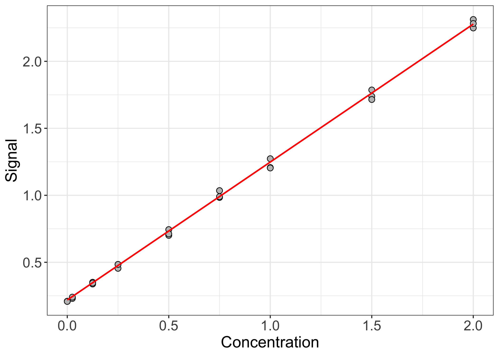
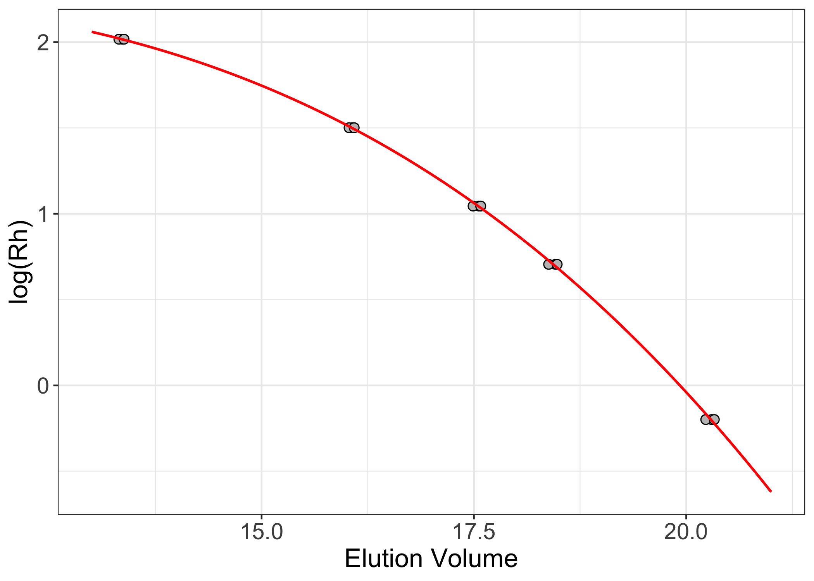

### Introduction

When working at the bench, there are probably certain experiments and/or
calculations that you routinely do that you <i>hate</i> doing. There’s
no logical reason for why you feel this way. The experiment/calculation
isn’t hard <i>per se</i>, you just wish that you didn’t have to do it
<i>again</i>.

With this feeling of frustration in mind, I decided to streamline some
of these common calculations so that the heavy lifting is done behind
the scenes (insofar as there is anything truly “heavy” about these
calculations – perhaps “the clicking-and-dragging” is more apt). The
result, <code>calibrateR</code>, is an easy-to-use R package that
contains functions to help with Gibson assembly reaction setup, protein
concentration determination via colorimetric assays, size exclusion
column calibration, and more. I am happy to expand
<code>calibrateR</code>’s current functionalities. Please reach out with
other ideas/suggestions!

<code>calibrateR</code> can be downloaded from
[GitHub](https://github.com/gbedwell/calibrateR).

### Usage

``` r
library(calibrateR)
```

#### Colorimetric Assays

I’ll start by describing the way that the package approaches
colorimetric assays. For those who might be unfamiliar, colorimetric
assays are a very common way of determining the concentration of
analytes in solution. There are various types of colorimetric assays,
but the general procedure is similar across the board. First, the user
must calibrate the assay by measuring the output signal across a range
of known analyte concentrations. Then, from the empirically determined
relationship between analyte concentration and signal, the concentration
of analyte in the experimentally relevant samples can be determined.

In the example below, I start with defined standard analyte
concentrations (<code>conc</code>) and three replicates
(<code>rep1-3</code>) of corresponding signal readings. Note that the
signal readings are entered <i>in the same order</i> as the known
concentrations.

``` r
conc <- c(2, 1.5, 1, 0.75, 0.5, 0.25, 0.125, 0.025, 0)
rep1 <- c(2.312, 1.786, 1.273, 1.035, 0.744, 0.484, 0.351, 0.237, 0.209)
rep2 <- c(2.249, 1.739, 1.207, 0.984, 0.701, 0.455, 0.338, 0.23, 0.209)
rep3 <- c(2.282, 1.715, 1.204, 0.99, 0.712, 0.484, 0.345, 0.24, 0.208)
```

Next, I will use the <code>calibrate_colorimetric()</code> function in
<code>calibrateR</code> to create a new function, here called
<code>bca()</code>, to do all of the downstream data analysis for me.

``` r
bca <- calibrate_colorimetric(conc = conc,
                              abs = c( rep1, rep2, rep3 ),
                              with.blank = TRUE,
                              nrep = 3)
```

With the calibrated function defined, we can do one of two things. The
first thing we should do is look at our fit and make sure it’s
reasonable. To do this, we’ll use our concentration values to calculate
expected signal values based on the fit parameters. To do this, call
<code>bca( a = conc, return.conc = FALSE )</code>. In this instance, we
enter the known concentration values, and tell the function that it is
<i>not</i> returning concentration values (it’s returning signal
values). Because the units of both concentration and signal can vary
widely across assays, I intentionally left units off of the example
plot.

``` r
library(ggplot2)

bca.df <- data.frame(conc = conc,
                     meas = c(rep1, rep2, rep3))

bca.fit.df <- data.frame(conc = conc, 
                         fit = bca(a = conc, return.conc = FALSE))

ggplot(bca.df, aes(x = conc, y = meas)) +
  geom_point(shape = 21, color = "black", fill = "gray75", size = 2.5) +
  geom_line(data = bca.fit.df, aes(x = conc, y = fit), color = "red", linewidth = 0.75) +
  theme_bw() + 
  theme(axis.text = element_text(size = 14),
        axis.title = element_text( size = 16)) +
  labs(x = "Concentration", y = "Signal")
```


The fit seems reasonable. The observed data points lie nicely along the
fitted line. Now that we’ve calibrated the assay and are fairly
confident that the calibration makes sense, we can feed in signal values
from samples of unknown concentration. Here, we’ll assume that we have
five unknown samples and that each unknown sample was measured at a
2-fold dilution. We will use <code>return.conc = TRUE</code> and
<code>df = 2</code> in <code>bca()</code> to tell the function that it
<i>is</i> returning concentration values and to define the dilution
factor(s), respectively. The returned units of concentration are the
same as the units of concentration used to make the standard curve.

``` r
set.seed(1234)
unk <- runif(5, min = 0.3, max = 2)

bca(a = unk, return.conc = TRUE, df = 2)
#> [1] 0.5453686 2.2248925 2.1818814 2.2284591 3.0128681
```

#### Gibson assembly

To calculate Gibson assembly reaction volumes, you need to define eight
parameters for each reaction. These are: insert concentration(s), insert
length(s), vector concentration, vector length, the number of fragments
in the reaction, the molar ratio of insert to vector, the mass of vector
in the reaction (in ng), and the final volume of the reaction
<i>before</i> the addition of 2x master mix. Concentration units should
be ng/µL (or equivalent) and length units should be bp.

The function can calculate parameters for multiple reactions one fell
swoop. Vectors with lengths corresponding to the number of unique
reactions must be entered for all parameters except insert concentration
and insert length. For each reaction, the function will then extract the
relevant parameters from the input vectors and perform the requisite
calculations. A list of data frames is returned, where each list element
represents a unique reaction.

In the example below, I’m calculating reaction parameters for two
reactions. The first reaction has 2 input fragments and the second has
3.

``` r
gibson( insert.conc = c(35, 78, 48, 37, 40), 
        insert.len = c(1894, 2403, 887, 1764, 943),
        vec.conc = c(55, 65), 
        vec.len = c(4710, 5934), 
        n.frag = c(2, 3), 
        vec.mass = rep(50, 2),
        molar.ratio = rep(3, 2), 
        final.vol = rep(5, 2), 
        ids = c("Reaction 1", "Reaction 2"))
#> $`Reaction 1`
#>            Volume
#> Fragment 1   1.72
#> Fragment 2   0.98
#> Vector       0.91
#> Water        1.39
#> Master Mix   5.00
#> 
#> $`Reaction 2`
#>            Volume
#> Fragment 1   0.47
#> Fragment 2   1.21
#> Fragment 3   0.60
#> Vector       0.77
#> Water        1.95
#> Master Mix   5.00
```

#### Size exclusion column calibration

Size exclusion chromatography (SEC) is a wildly available technique that
can provide useful information about macromolecules. Most commonly, SEC
is associated with molecular weight. However, SEC actually separates
macromolecules according to their hydrodynamic radius (or Stokes
radius). For macromolecules with similar overall shapes, changes in
hydrodynamic radius are due predominantly to changes in the number of
atoms present in the molecule (i.e., its mass). For macromolecules of
different shapes, however, separation based on hydrodynamic radius is a
poor indicator of molecular weight. For this reason, it is important to
be able to calibrate SEC columns for both radius and mass.

The <code>calibrate_sec()</code> function in <code>calibrateR</code>
works similarly to the <code>calibrate_colorimetric()</code> function
described above. The function minimally requires the user to define
three parameters: the measured elution volume of standard analytes, the
masses (yes, just the masses; in Da) of standard analytes, and the
macromolecular parameter of interest – either molecular weight
(<code>mw</code>) or hydrodynamic radius (<code>rh</code>).

``` r
masses <- c( 670000, 158000, 44000, 17000, 1350 )
rep1 <- c( 13.36, 16.07, 17.56, 18.46, 20.30 )
rep2 <- c( 13.32, 16.03, 17.49, 18.38, 20.23 )
rep3 <- c( 13.38, 16.09, 17.58, 18.48, 20.33 )
```

``` r
sec.rh <- calibrate_sec(vols = c(rep1, rep2, rep3),
                        masses = masses,
                        parameter = "rh")
```

Running <code>calibrate_sec()</code> returns a function for downstream
number crunching. Setting <code>parameter = “rh”</code> uses a
[previously
published](https://febs.onlinelibrary.wiley.com/doi/full/10.1046/j.0014-2956.2001.02649.x?sid=nlm%3Apubmed)
scaling law to convert the provided mass values to radius values.

Convention for SEC column calibration plots is to plot $\log{(M)}$ or
$\log{(R_H)}$ vs. volume. Here, I will create a sequence of dummy
elution volumes between the observed elution volumes for the standard
analytes. Because I calibrated the column based on hydrodynamic radius
instead of mass, I will use the function <code>mass_to_radius()</code>
to convert the standard analyte masses to hydrodynamic radii. Then, I
will use the calibration to calculate the expected radii of analytes
eluting at each of the dummy elution volumes. Non-normalized elution
volumes are typically entered in mL units. Because these units don’t
strictly matter, however, I’ve left those units off of the plot. The
y-axis values are log-transformed. By default, however, the function
automatically re-transforms the expected values to the linear scale.
Note that the input mass units must be g/mol (Daltons). Calculated mass
values are returned in the same units. Hydrodynamic radius values are
returned in nm.

``` r
sec.df <- data.frame(vols = c(rep1, rep2, rep3),
                     rads = mass_to_radius(masses = masses))

sec.fit <- data.frame(vols = seq(13, 21, 0.01),
                      fit = sec.rh(seq( 13, 21, 0.01)))

ggplot(sec.df, aes(x = vols, y = log(rads))) +
  geom_point(shape = 21, color = "black", fill = "gray75", size = 2.5) +
  geom_line(data = sec.fit, aes(x = vols, y = log(fit)), color = "red", linewidth = 0.75) +
  theme_bw() + 
  theme(axis.text = element_text(size = 14),
        axis.title = element_text(size = 16)) +
  labs(x = "Elution Volume", y = "log(Rh)")
```



To apply the calibrated function to analytes of unknown mass/radius,
simply enter the empirical elution volume of the analyte into the
function. If the column calibration was done using normalized elution
volumes, the function <code>normalize_ev()</code> will normalize the
analyte elution volumes based on the column’s void and column volumes.

``` r
sec.rh(16.495)
#>      a 
#> 3.9831
```

#### UV/Vis

Concentration determination by UV/Vis spectroscopy is very common in the
lab. The <code>calibrateR</code> function <code>uv_vis()</code> takes as
input the measured absorbance at the desired wavelength, the extinction
coefficient of the molecule of interest, the dilution factor of the
measurement, the path length of light, and the type of molecule being
measured. If the type of molecule being measured is “protein”, the
extinction coefficient must be defined. If the type of molecule is one
of dsDNA, ssDNA, or ssRNA, the extinction coefficient can be
<code>NULL</code>, and the standard (average) extinction coefficients
for these macromolecules are used. The path length defaults to 1 cm.

In the example below, a two-fold dilution of a purified protein with an
extinction coefficient of 35000 M<sup>-1</sup>cm<sup>-1</sup> was
measured to have an absorbance of 0.491 at 280 nm. <code>uv_vis()</code>
returns concentrations in same concentration units used in the
extinction coefficient. In the example, that is molar units.

``` r
uv_vis(abs = 0.491, 
       ext = 35000,
       df = 2,
       type = "protein")
#> [1] 2.805714e-05
```
