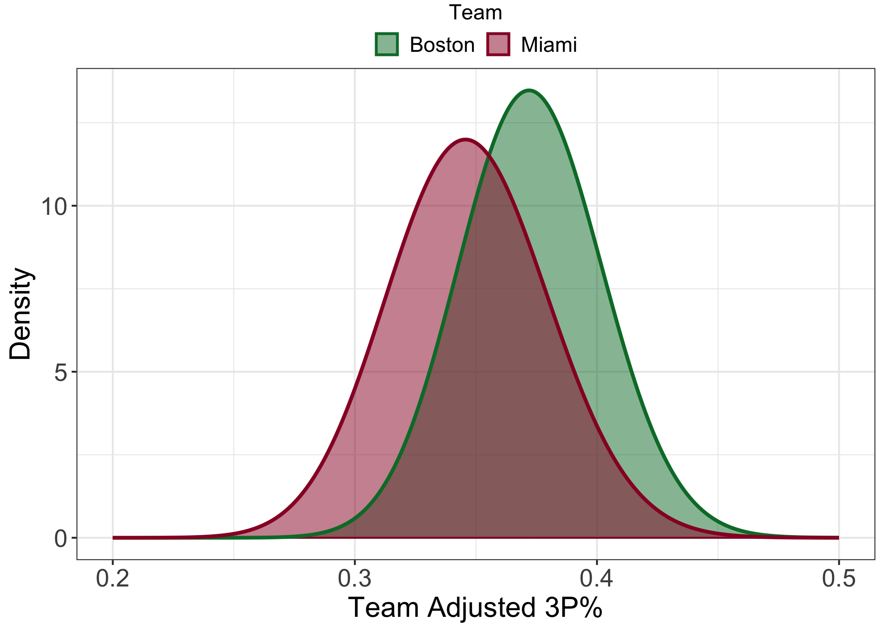
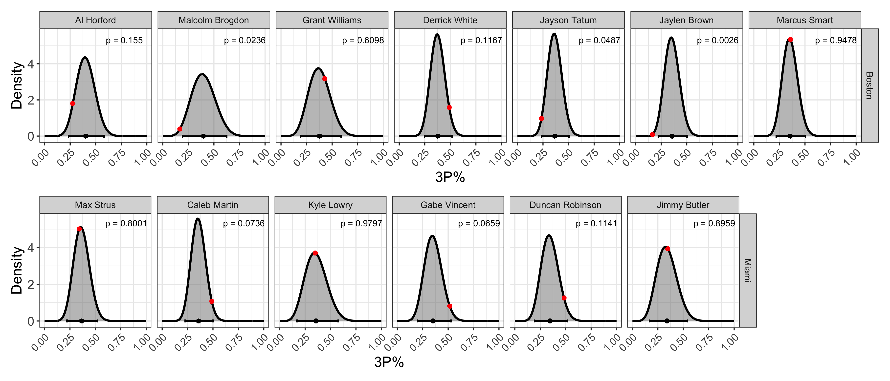

### Introduction

The 2022-2023 NBA season is over. The Denver Nuggets, this season’s
Western Conference champions and Finals favorites, defeated the
never-say-die Miami Heat in the Finals 4 games to 1. The Nuggets, led by
the virtually unstoppable Nikola Jokíc (who <i>averaged</i> 30-13.5-9.5
per game across these playoffs), made relatively easy work of the 8-seed
Heat. Nevertheless, the Heat’s impressive, and at times utterly
dominant, run through both the 1-seed Milwaukee Bucks (4-1) and the
2-seed Boston Celtics (4-3) has already had [significant
consequences](https://www.nba.com/bucks/news/milwaukee-bucks-part-ways-with-head-coach-mike-budenholzer)
and could yet have more.

In the Eastern Conference Finals (ECF) against the Celtics, the Heat
overturned double-digit deficits in the second halves of both Games 1
and 2 and went on to win them both. Game 3 was an emphatic 128-102 Heat
victory. The Celtics won the next 3 games, evening the series at three
games apiece and forcing a deciding Game 7 back in Boston. In this
winner-take-all showdown, the Heat absolutely embarrassed the home team
with a 103-84 victory. Much has been said about how this ECF played out.
Most of this commentary can be succinctly summarized: the Heat had “that
dawg in ‘em”, and the Celtics simply did not. It’s hard not to be at
least a little sympathetic to this argument. Another, more tangible,
aspect of the series, however, was the apparent difference in 3 point
shooting percentage (3P%) between the Heat and the Celtics. Per
[basketball-reference](https://www.basketball-reference.com/leagues/NBA_2023.html),
the Celtics rode the three point shot to 57 wins over the 2022-2023 NBA
season, shooting 42.6 threes per game (2nd overall) with a season
average 37.7% success rate (6th overall). The Heat, on the other hand,
shot 34.8 threes per game (10th overall) with a measly 34.4% success
rate (27th overall). During the
[ECF](https://www.basketball-reference.com/playoffs/2023-nba-eastern-conference-finals-heat-vs-celtics.html),
however, the Heat shot 43.4% from behind the arc, while the Celtics shot
just 30.3% – a staggering reversal. Notably, Celtics stars Jayson Tatum
and Jaylen Brown went a combined 18/90 (20%) from downtown, while Heat
role players Caleb Martin, Gabe Vincent, and Duncan Robinson went 53/107
(49.5%). It was, in other words, a perfect storm of sustained
under-performance from players on one team paired with sustained
over-performance from players on the other. Exactly how bad was the
Celtics’ 3P% in the ECF relative to their regular season numbers? How
good was the Heat’s?

My general approach to answering these questions is as follows:

1.  Collect league-wide data for the 2019-2023 regular seasons.
2.  Use this collated data to estimate the “true” 3P% for the 2022-2023
    Miami Heat and Boston Celtics
3.  Re-scale the season-long 3P% distributions to the ECF.
4.  Calculate the probabilities of observing the actual ECF 3P% from the
    adjusted 3P% data.

In an attempt to avoid clutter, I will leave a lot of the nitty gritty
details out of this published post. You can, however, find the entire
.Rmd file with (hopefully) helpful comments
[here](https://github.com/gbedwell/gbedwell.github.io/blob/master/_R/ecf-three.Rmd).

All of the data used in this post was retrieved from the fantastic
[basketball-reference.com](https://www.basketball-reference.com/) using
[rvest](https://cran.r-project.org/web/packages/rvest/index.html).

### 3P% and parameter estimation

Statistically speaking, every shot that a player takes is a [Bernoulli
random variable](https://en.wikipedia.org/wiki/Bernoulli_distribution)
with some probability of success. Not all shots are the same, however. A
3-point shot taken from center court, for instance, is going to have a
lower probability of success than a 3-point shot taken with the
shooter’s toe just behind the arc. Because of this, the probability of
success varies from shot to shot. Over time, however, it is reasonable
to assume that the types of shots that a player takes will, on average,
be similar to the shots taken by players across the entire league. Under
this assumption, a player’s reported shooting percentage can be thought
of as the <i>average</i> probability of success that any given shot that
player takes will result in a basket. A series of shots taken by the
player over the course of a game, series, or season can therefore be
described as a [binomial random
variable](https://en.wikipedia.org/wiki/Binomial_distribution) with a
probability of success equal to the player’s shooting percentage. There
is an inherent degree of randomness to shooting, however, and an
observed shooting percentage might not be the best estimate of the
player’s <i>true</i> shooting percentage. In fact, a player’s shooting
percentage can itself be represented as a range of possible values. The
most convenient way to represent this range of probabilities as a [beta
distribution](https://en.wikipedia.org/wiki/Beta_distribution). The beta
distribution is defined only over the interval \[0, 1\] and is
characterized by the shape parameters $\alpha$ and $\beta$. These shape
parameters can be thought of as the number of successes and the number
of failures in a series of Bernoulli trials, respectively.

[Empirical Bayes
estimation](https://en.wikipedia.org/wiki/Empirical_Bayes_method) is an
effective technique for improving parameter estimates relative to
raw/observed values alone. The technique is called “empirical” Bayes
because, unlike in <i>bona fide</i> Bayesian analysis, the [prior
distribution](https://en.wikipedia.org/wiki/Prior_probability) is
derived from the data itself, rather than specified beforehand.
Regardless of how/when the prior is specified, however, once the prior
has been established, the observed data can “updated” in a way that
pulls the observed data towards the mean value. This has the effect of
reducing the variance in our data and therefore giving us more
confidence in the values themselves. For a fantastic introduction to
empirical Bayes, see David Robinson’s [blog posts and
book](http://varianceexplained.org/r/empirical-bayes-book/).

Here, I’ll use both player- and team-level estimates of 3P% for the
2022-2023 regular season. The data were adjusted using empirical Bayes.
I’ll not go into much more technical detail here, but if you’re
interested, the .Rmd file contains the steps for prior estimation and
data updating.

### 2023 Eastern Conference Finals 3P%

The general question that I am attempting to address here is: how did
3-point shooting for both teams in the ECF compare to their regular
season numbers? The ECF is a 7-game, best-of-four series. The number of
shots taken by even the most prolific 3-point shooter during a 7-game
series will be substantially less than the number of shots that same
player might take during the 82-game regular season. To compare regular
season 3P% with ECF 3P%, therefore, it is important to re-scale the
season 3P% distributions to be compatible with the number of shots taken
during the ECF. To do this, we can essentially act as if we are randomly
re-sampling shot attempts from the season-long data to generate a new
distribution that, in the end, reflects the number of shot attempts
taken in the ECF.

#### Team analysis

During the regular season, the Celtics’ team-wide average adjusted 3P%
was 37.29%. The Heat’s was 34.72%. On average, therefore, the Celtics
were a better 3-point shooting team. We might reasonably expect this
trend to continue into the ECF. These average values, however, fail to
tell the whole story. Comparing the re-scaled team adjusted 3P%
distributions (below), we can see that there is a substantial degree of
overlap between the respective distributions. This means that there is a
non-zero chance the Heat outshoot the Celtics in the ECF. We can
estimate this probability by sampling from these respective
distributions many times and quantifying the fraction of times that the
Heat’s 3P% is better than the Celtics’. Doing this, we find that the
probability that the Heat outshoot the Celtics in the ECF given their
regular season 3P% is 28.11% – not <i>great</i>, but certainly not bad,
either. Let’s take a look at what actually happened.

During the ECF, the Celtics went 81/267 from three (30.34%), while the
Heat went 89/205 (43.41%). Clearly, the Heat’s 28.11% chance of
outshooting the Celtics from three was not for nothing! Using the
“expected” distributions, we can easily calculate the probabilities of
each team having the performance that they did. However, because both
teams could have hypothetically under- or over-performed (think of the
observed ECF as just one hypothetical outcome out of many), I think it’s
more interesting to calculate two-tailed probabilities. That is, I will
calculate the probability of either team under- <i>or</i>
over-performing <i>to the same or greater degree</i> given their regular
season 3P%. For the Celtics, the chance of them doing this is just
1.59%. For the Heat, the number is similar: 1.08%. The way that this ECF
played out, therefore, at least with respect to 3-point shooting, was
pretty unlikely given the respective team’s regular season 3P%. It
should be noted that there is no shortage of qualifiers to append to
that last statement. There is certainly more at stake during a
Conference Championship than an inconsequential game against a
bottom-of-the-league team in February, for instance, and that mental
impact is something that I have completely disregarded here.
Nevertheless, I believe that any of us would be hard-pressed to find
someone who thought that the 3-point shooting disparity during the ECF
would have been what it was.

#### Player analysis

Team shooting efficiency is calculated from the shooting efficiencies of
the individual players on the team. It might be interesting, therefore,
to dig into player-level data to identify which (if any) players
contributed most dramatically to the observed ECF outcome. Below, I show
the re-scaled 3P% distributions for each player that took 15 or more
3-point shots in the ECF (open in new tab to expand). In addition to the
re-scaled 3P% distributions themselves, the 95% credible intervals, and
the observed ECF 3P% (red points) are also included. The 95% credible
interval defines the range that contains 95% of the possible values for
a given player’s 3P%. This doesn’t mean that a player cannot have a 3P%
outside of that range. It just means that there is a less than 5% chance
that the player will. The data shown in the plot below is striking. For
the Celtics, Malcolm Brogdon, Jayson Tatum, and Jaylen Brown all shot
<i>below</i> the lower limit of their respective 95% credible interval.
Malcolm Brogdon, however, was playing with a torn tendon in his shooting
elbow and should therefore be given significant leeway for his apparent
drop in form. Al Horford shot close to the lower limit of his 95%
credibility interval, but ultimately inside of it. Grant Williams and
Marcus Smart shot near their season average, and so can’t be held
responsible for the Celtics’ abysmal shooting. Derrick White was the
only Celtic who shot near the upper end of his 95% credible interval.
For the Heat, it was an different story entirely. Of the 6 Heat players
included as a player-of-interest, 3 of them – Max Strus, Kyle Lowry, and
Jimmy Butler – all shot very near their season adjusted 3P%. The other 3
Heat players – Caleb Martin, Gabe Vincent, and Duncan Robinson – all
shot near the upper end of their respective 95% credible intervals. In
other words, the performances of the players on the respective teams are
almost mirror images of each other (with Derrick White being the most
notable exception).

### Conclusions

The way that the 2022-2023 ECF unfolded came as a surprise to many,
myself included. The surprise, however, was less in the fact that the
Heat beat the Celtics, but in <i>how</i>. The Celtics, the NBA’s
second-best 3-point shooting team during the regular season, shot like
the regular season Heat during the ECF. The ECF Heat, on the other hand,
shot like the regular season Celtics. It was a stunning reversal. That
<i>one</i> of those two things might happen was unlikely enough. That
they would both happen is incredible. I might argue that the Celtics’
drop in form was worse and has worse implications than the Heat’s
(noteworthy) over-performance. The Heat had what might have been
career-best performances from Caleb Martin, Gabe Vincent, and Duncan
Robinson – three undrafted role players who most people watching the ECF
might have never heard of before then. The Celtics, on the other hand,
saw their big shooters vanish. Jayson Tatum (first team all-NBA) and
(especially) Jaylen Brown (second team all-NBA) had a series to forget,
and hopefully they will. The statistical improbability of the 3-point
shooting during the ECF is something to behold. It defied all
(reasonable) expectations and, ultimately, you can’t help but marvel
that it happened. That’s sports!
